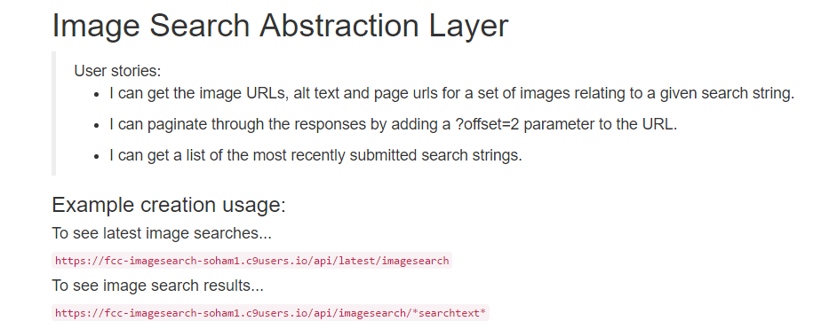
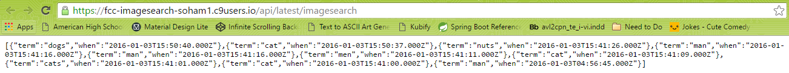
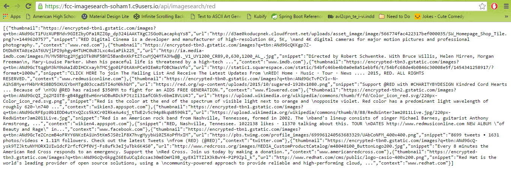

#Image Search Abstraction Layer

This is a solution for https://www.freecodecamp.com/challenges/image-search-abstraction-layer

User Story: I can get the image URLs, alt text and page urls for a set of images relating to a given search string.

User Story: I can paginate through the responses by adding a ?offset=2 parameter to the URL.

User Story: I can get a list of the most recently submitted search strings.

##Screenshot

###Landing Page

###User can see all of the latest searches by going to https://fcc-imagesearch-soham1.c9users.io/api/latest/imagesearch

###User can see the results for a given search parameter by going to https://fcc-imagesearch-soham1.c9users.io/api/imagesearch/*searchtext*

##Technologies Used:
- Node.js
- Express